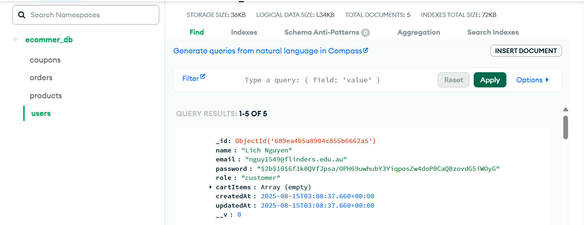
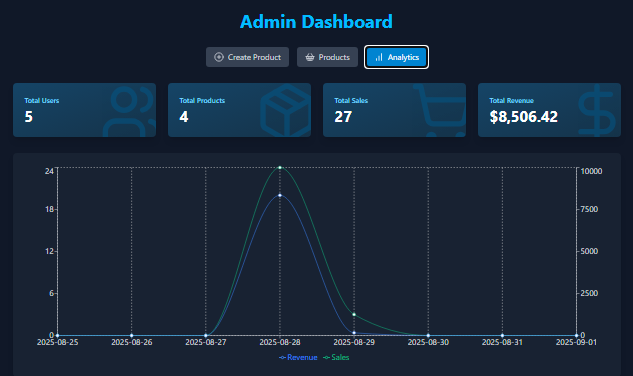

# User Authentication

# MongoDB and Redis
Redis will store featured products and refresh tokens

MongoBD store user, product, orders, coupons data

# Pages

### Home Page

### Cart Page
User can apply or delete coupon, show the Saving price, Total price, Original price.

### Stripe Payment Page

### Checkout Success Page
After successful payment, the user automatically receive email about Order ID, Total cost.

### Checkout Cancel Page
User click on "Back" to cancel payment

# Email Confirmation

# Admin Features

### Modify Product Page
All products pop up and Admin can trigger featured products

### Analytics Page
This page show the chart to track Products bills, Revenue, User count

## Expanding the ESLint configuration

